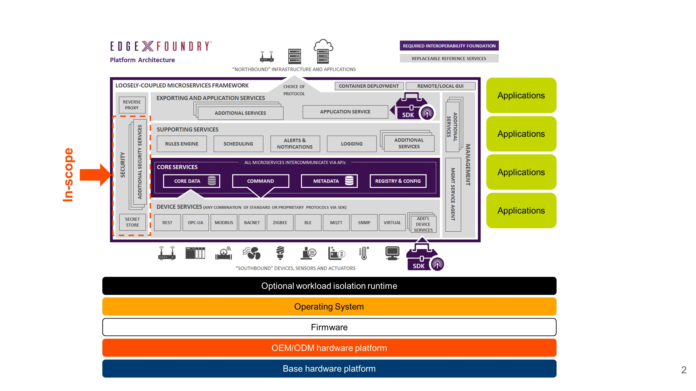

# Architecture Diagrams

## EdgeX Secret Management in Context

The secret management components comprise a very small portion of the framework.  Many components of an actual system are out-of-scope including the underlying hardware platform, the operating system on which the framework is running, the applications that are using it, and even the existence of workload isolation technologies such as containers or snaps. The secret management architecture thus takes a pessimistic view of the available protections in the underlying runtime.

[Secret Management In Context SVG](arch-in-context.svg)

## AS-IS Architecture

Here is the current as-is architecture.

[AS-IS SVG](arch-as-is.svg)

## High Level Architecture

In the following diagram of the high level architecture of the secret management solution, the primary assets (P-#) and seconary assets (S-#) can be found in the [threat model documentation](threat_model.md).

[High Level Architecture SVG](high_level_architecture.svg)

The secrets to be protected are the application secrets **(P-1)**. The application secrets are protected with a per-service [Vault](https://www.vaultproject.io/) [service token](https://www.vaultproject.io/docs/concepts/tokens.html#service-tokens) **(S-1)**.  The Vault service token must be delivered to the service in a secure manner.  Given the diversity of possible runtime environments, it is not possible to either directly ensure the token is available at startup nor have the application pull the token at runtime.  Instead a [coprocess](https://www.hashicorp.com/blog/cubbyhole-authentication-principles) approach is used, where a token-issuing service delivers to the token to a prearranged rendezvous location and the service pulls it from there. A filesystem-based rendezvous is simplest to use and compatible with container-based, chroot-based, or Mandatory Access Control service isolation models without imposing a requirement on every service to implement an HTTP endpoint to receive secrets. Simply the Vault token unencrypted to persistent disk could compromise the token, so it is instead wrapped via a temporary [cubbyhole](https://www.vaultproject.io/docs/secrets/cubbyhole/index.html) token **(S-2)** and delivered by a tmpfs volume to the service at a predefined location.  (The service can read an environment variable to learn of this location.)  This cubbyhole token can be exchange exactly once (with Vault) for the service token.  It is an alertable security event if the token's confidentiality is compromised and attempted to be used multiple times.

The service token is issued by a token-issuing service that watches the [Consul](https://www.consul.io/) registry for new service registrations and uses this as a trigger to generate new service tokens while revoking the old one.  The token-issuing service has its own non-root token-issuing token **(S-3)** that is delivered in the above-described manner.  The token-issuing service must be long-running and restartable, but need not expose an external API.  As such, it must have a persistent data store to retain its token across service restarts, but must store it encrypted.  The token-issuing service is issued a TLS certificate **(S-10)** that the service can use to perform a public-key encryption on the token before persisting it.  This TLS certificate will be rotated on every boot in order to invalidate the stored token across device restarts.  The token-issuing-token is generated from the Vault root token **(S-4)** that is available when the vault is initialized or unsealed. The root token is revoked after generating the token-issuing-token.

The TLS keypair used for encrypting the token-issuing-token is used by a PKI-initialization component.  The PKI initialization component is responsible for generating a root certificate authority **(S-8)**, one or more intermediate certificate authorities **(S-9)**, and several leaf certificates **(S-10)** needed for initialization of the core services.  In a software-based implementation, all of the PKI infrastructure must be generated and distributed to the consuming services on tmpfs volumes on each boot. The private keys for the intermediate and issuing CAs are then discarded to prevent further use.  In a hardware-based implementation, the CA can persist across restarts and Vault can be given its own intermediate certificate authorities for issuing TLS client and server certificates used for service-to-service authentication.  The TLS certificates for the core services should be encrypted with a per-service password randomly generated at installation time to protect their confidentiality.

The actual application secrets are stored in the Vault encrypted data store **(S-6)** that is actually stored in Consul's data store **(S-7)**.  The vault data store is encrypted with a master key **(S-5)** that is forgotten across Vault restarts and resupplied on every boot.  In software-only implementations, this Vault master key is wrapped by a PGP key **(S-12)** and password **(S-13)**.  The PGP assets should be generated per-installation: for example, the PGP key generated at install time and protected by a password derived from some kind of hardware fingerprint.  While this yields a predictable secret, it still yields a secret that is unique-per-device.  In a TPM-backed hardware implementation, the TPM uses a "primary object" **(S-11)** to bind user-created items to the TPM.  This primary object is persistent but is unique to that TPM and a new unique primary is generated every time the TPM is cleared, rendering any previous secrets protected by the TPM inaccessible.  In a TPM-backed hardware implementation, the master key is sealed to the TPM using the primary object and a customizable authorization policy that can depend on various configurations of passwords and local attestation.  This is often used in conjunction with some form of secure boot to order to ensure that the device has not been tampered with before the secret is released.

It is common practice to ensure that a secret retrieved from hardware secure storage can be retrieved only once.  Thus, it is recommended that the Vault be unsealed only once per boot and that device be automatically restarted in the Vault process dies.  Vault is capable of running in high-availability active-standby mode to mitigate somewhat the runtime implications of this choice.

## Simplification 1

If we can depend on every EdgeX framework deployment to separate services by UID/GID, containerization, chroot-like arhitecture, Mandatory Access Controls, or similar mechanisms such that one microservice cannot spy on the secret files of another microservice, we can remove the cubbyhole token usage from the architecture. This also simplification also then removes detection that such an attack is occurring.

[High Level Architecture 2 SVG](high_level_architecture-2.svg)

## Simplification 2

If we are willing to make vault-initiaization a long-running process whereby we do not block access to the master key after the system has booted, we can combine vault initialization and the token-issuing service into a single service.  This adds availability to the system but leaves the Vault master key accessible even after the system has fully booted.

[High Level Architecture 3 SVG](high_level_architecture-3.svg)

## Simplification 3

If neither Consul nor Vault are being run in highly-available mode, overall availability of the secret management implementation may be higher if Vault used its own data volume rather than depending on another service (Consul) as its storage engine.  (Vault would no longer automatically register itself with Consul in that case.)