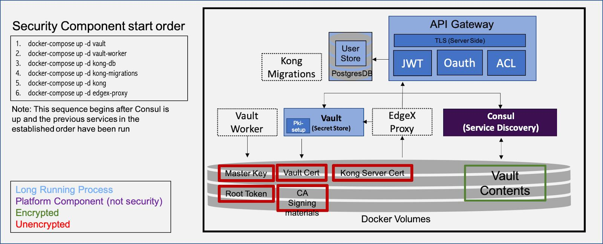

# Architecture Diagrams

## EdgeX Secret Management in Context

The secret management components comprise a very small portion of the framework.  Many components of an actual system are out-of-scope including the underlying hardware platform, the operating system on which the framework is running, the applications that are using it, and even the existence of workload isolation technologies such as containers or snaps. The secret management architecture thus takes a pessimistic view of the available protections in the underlying runtime.

## AS-IS Architecture

Here is the current as-is architecture.

## Proposed Architecture

In the following diagram of the high level architecture of the secret management solution, the primary assets (P-#) and secondary assets (S-#) can be found in the [threat model documentation](threat_model.md).

The secrets to be protected are the application secrets **(P-1)**. The application secrets are protected with a per-service [Vault](https://www.vaultproject.io/) [service token](https://www.vaultproject.io/docs/concepts/tokens.html#service-tokens) **(S-1)**.  The Vault service token is delivered by connecting to a Unix domain socket on which a token server is listening. The token server authenticates the caller by its peer process ID, authorizes the request by cross-referencing the process ID with a trusted information source (Linux kernel or Docker daemon), and then delivers a service-specific Vault token.  As a fallback method (configuration option), the Vault token is pre-populated and the service only need read the token out of a file, where Mandatory Access Control or namespaces constrain path accessibility. Vault access tokens are simply 128-bit random handles that are renewed at the Vault server.  They can be shared across multiple instances of a load-balanced service, and unlike a JWT there is no need to periodically re-issue them if they have not expired.

The token server has its own non-root token-issuing token **(S-3)** that is created by the security service with the root token after it has initialized or unlocked the vault but before the root token is revoked. **(S-4)**  For availability reasons and because it requires privilege to authenticate callers, it is co-located in the security service.

The actual application secrets are stored in the Vault encrypted data store **(S-6)** that is actually stored in Consul's data store **(S-7)**.  The vault data store is encrypted with a master key **(S-5)** that is held in Vault memory and forgotten across Vault restarts.  The master key must be resupplied whenever Vault is restarted.  The security service monitors Vault health and will automatically unseal the vault if it is determined to be in a sealed state.  The security service encrypts the master key with AES-256-GCM using a key **(S-13)** derived using a pluggable Key Derivation Function and stores it encrypted in persistent storage.  The software-only KDF derives a key based on a hardware fingerprint, such as the output of `lshw`.  In this manner the initial keying material for the KDF is never stored persistently on disk.  Vendor implementations may create KDFs that rely on hardware mechanisms such as trusted execution environments (TEEs), enclaves, or dedicated hardware such as a TPM, so long as it can be invoked as a standalone executable.  Such implementations are out of the scope of the EdgeX Foundry reference implementation, which is software-only.

Confidentiality of the secret management APIs is established using server-side TLS.  In fact, Vault _requires_ TLS to boot.  The PKI initialization component is responsible for generating a root certificate authority **(S-8)**, one or more intermediate certificate authorities **(S-9)**, and several leaf certificates **(S-10)** needed for initialization of the core services.  The PKI can be generated afresh every boot, or generated during initial provisioning and cached.  As in the file-based Vault service token distribution case, namespacing or Mandatory Access Control is assumed to guard the TLS private keys for services.  If the implementation allows, the private keys for certificate authorities should be destroyed after PKI generation to prevent unauthorized issuance of new leaf certificates, except where the certificate authority is stored in Vault and controlled with an appropriate policy.  TLS keying material is distributed to services via the same file-based mechanisms using the same kinds of protections mentioned earlier.  TLS private keys are not password-protected due to lack of support for this protection in the consuming services.