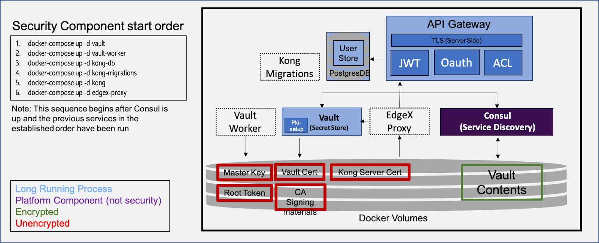
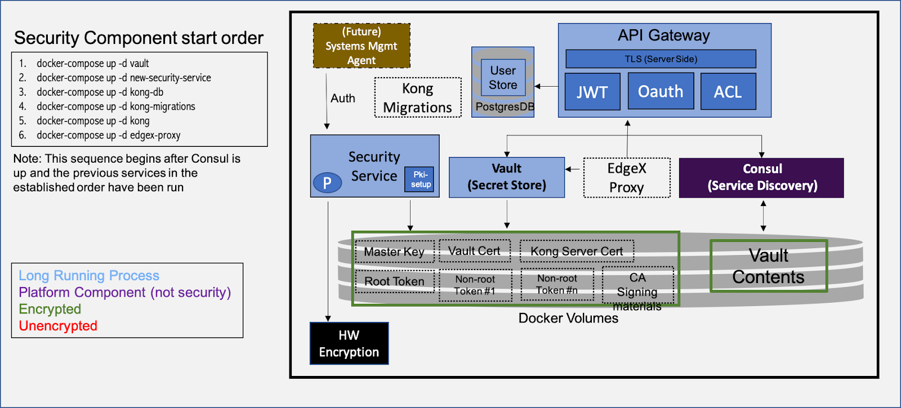

# Background

## Security Roadmap

The EdgeX Foundry security roadmap is published on the Security WG Wiki:

* https://wiki.edgexfoundry.org/display/FA/Security+Working+Group
* https://wiki.edgexfoundry.org/download/attachments/329467/EdgeX%20Security%20Architecture%20Roadmap.pptx?version=1&modificationDate=1536753478000&api=v2

## Hardware Secure Storage Roadmap

The EdgeX Foundry has called for hardware secure storage:

*Initial EdgeX secrets (needed to start Vault/Kong) will be encrypted on  the file system using a secure storage abstraction layer – allowing other implementations to store these in hardware stores (based on hardware root of trust systems)*

* https://www.edgexfoundry.org/blog/2018/11/15/edgex-foundry-releases-delhi-and-plans-for-edinburgh/
* https://wiki.edgexfoundry.org/display/FA/Edinburgh+Release

## Hardware Secure Storage Draft Proposal

The current state of secret storage is described in the Hardware Secure Storage Draft (https://docs.google.com/document/d/1MsTNdwtZp3zA-nPhCC3COakL3e5mrhJuFByy6ja5OxU/edit).

The AS-IS architecture resembles the following diagram:

As the diagram notes, the critical secrets for securing the entire on-device infrastructure sit unencrypted on bulk storage media. That the Vault contents is shown as encrypted is misleading: the master key to decrypt the vault is in plaintext nearby. Moreover, the current state is actually worse pictured, as some of these root secrets, in the containerized incarnation of the EdgeX Framework, are mistakenly included in the container images themselves.

The Hardware Secure Storage Draft proposes the following future state:

This future state proposes a security service that can encrypt the currently unencrypted data items.

A number of problems must be resolved to make this future state a reality:

* Initialization order of containers: containers must block until their prerequisites have been satisfied. It is not sufficient to have only start-ordering, as initialization can take a variable amount of time, and the initialization tasks of a previous step are not necessarily completed before the next step is initiated.
* Allowing for variability in the hardware encryption component.  A simple bulk encryption/decryption interface does not allow for interesting scenarios based on local attestation, for example.
* Distribution of Vault tokens to services.

## Next Steps

While it is a good start, encrypting the root secrets does not itself result in a robust secret management design. What is needed is a systematic approach to secret management that will close the gaps between the AS-IS and TO-BE future state.  This systematic approach is based on formal threat model with the aim that the system will meet some critical security objectives, which include, among others:

- Ensure confidentiality, integrity, and availability of application secrets.
- Prevent off-line copying of application secrets by binding them to secure hardware storage.

Through threat modeling, we can identify assets, adversaries, threats, and mitigations against those threats.  We can then make a prioritized implementation plan to address those threats.

