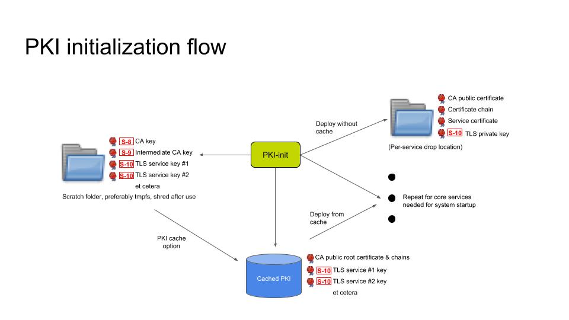
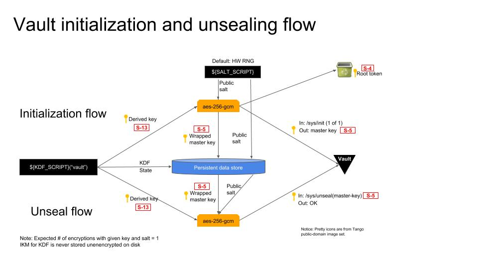
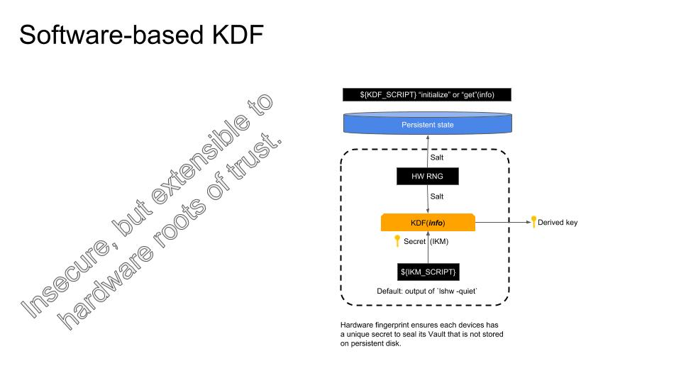
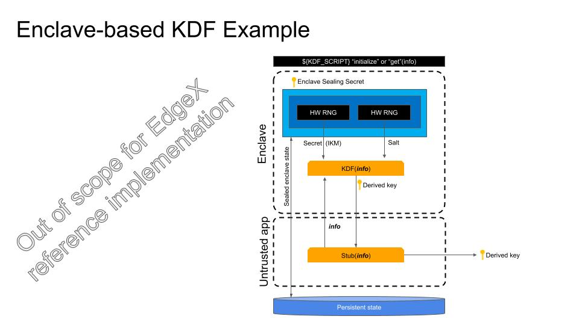
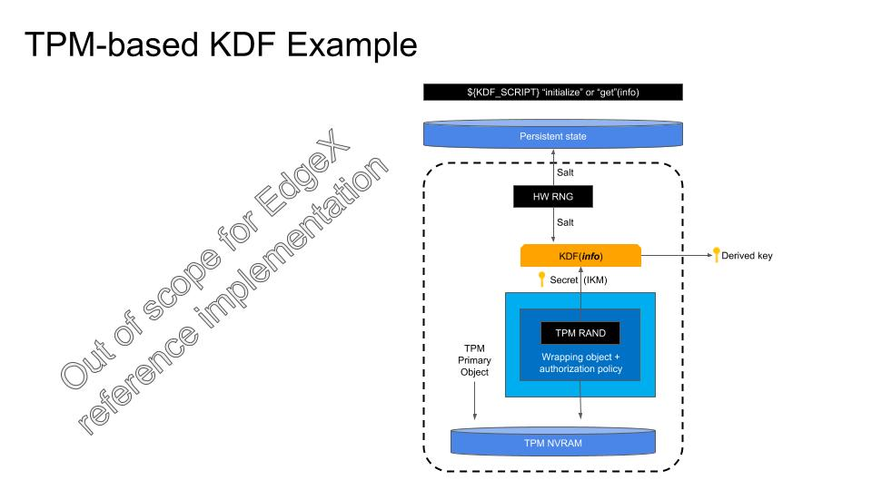
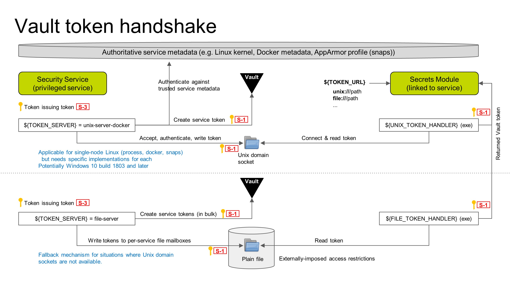

# Detailed Design

This document gets into the design details of the proposed secret management architecture, starting with the high-level design and going into greater detail for each subsystem.

## High-level design

Figure 1:  High-level design.

The [Architecture Diagrams](architecture_diagrams.md) document provides a high-level walkthrough of the secret store data and execution flow.

## PKI Initialization

Figure 2: PKI initialization.

PKI initialization must happen before any other component in the secret management architecture is started because Vault requires a PKI to be in place to protect its HTTP API.  Creation of a PKI is a multi-stage operation and care must be taken to ensure that critical secrets, such as the the CA private keys, are not written to a location where they can be recovered, such as bulk storage devices.  The PKI can be created on-device at every boot, at device provisioning time, or created off-device and imported.  Caching of the PKI is optional if the PKI is created afresh every boot, but required otherwise.  Following creation of the PKI, or retriving it from cache, the PKI initialization is responsible for distributing keying material to pre-agreed per-service drop locations that service configuration files expect to find them.

PKI initialization is not instantaneous.  Even if PKI initialization is started first, dependent services may also be started before PKI initialization is complated.  It is necessary to implement init-blocking code in dependent services that delays service startup until PKI assets have been delivered to the service.

Most dependent services to do support encrypted TLS private keys.  File access controls offered by the underlying execution environment are their only protection.

A potential future enhancement is to use the pluggable Key Derivation Function to derivate an encryption key to encrypt the cached PKI keying material.

## Vault initialization and unsealing flow

Figure 3: Vault initialization and unsealing flow

When the security service starts the first thing that it does is check for the existence of an encrypted Vault master key.  If it is not present, it attempts to initialize the Vault.  Otherwise, it checks Vault's status and if sealed automatically unseals it.

This component uses a number of plugins that are packaged as executables that return results on their standard output.  The EdgeX reference implementation provides software-based reference plugins that are portable across a wide variety of platform architectures.  Binding of the EdgeX Vault to a hardware root of trust is done through use of a hardware-dependent plugin.

The security service has three different plugin hooks:

* `SALT_SCRIPT`: This environment variable specifies an executable that supplies a random salt value on its standard output.  By default, this script will use the golang hardware random number generator API.
* `KDF_SCRIPT`: This environment variable specifies an executable that takes a user-supplied "info" argument that is supplied to an HMAC KDF.  The KDF takes input key material (IKM) and a random seed and uses these to produce a pseudorandom key (PRK).  The "info" argument is then used to derive multiple keys from this.  The same input key material and same seed can be used to reproducibly derive a tree of keys from the initial secret.  The input key material must be kept secret, but the seed and info need not be.  In the case of a hardware KDF, the input key material should simply be a hardware-protected persistent random number.
* `IKM_SCRIPT`: This is used in the reference software KDF to supply input key material in the case where hardware secure storage is not available.  By default, this script will attempt to compute and return a fingerprint the running system.  The output of the IKM_SCRIPT is never stored persistently.

### Initialization flow

For the Vault initialization flow, Vault is initialized with a single key share.  The Vault master key is then encrypted with the KDF-derived key using AES-256-GCM using a plugin-supplied random salt value.  AES-GCM protects against padding oracle attacks, but is sensitive to re-use of the salt value.  For this application, it is expected that Vault master key is encrypted exactly once on a given platform and thus there is sufficient entropy in the salt to avoid encrypting a different master key with the same salt even if the Vault is initialized multiple times (for example, a QA platform).

The encrypted master key is then stored in persistent storage along with the salt value.

The facility provided by Vault to PGP-wrap key shares on initialization is not used, as it would require introducing the `openpgp` dependency which is large and over-complicated, given that no humans are involved in unsealing the vault.  Direct encryption of the Vault master key is simpler and isolates the implementation from security bugs in `openpgp` that could result in decryption failures later.

### Unseal flow

In the unseal flow flow, the above process is reversed.  The KDF is invoked to regenerate the derived key used to encrypt the Vault mater key.  The salt is retrieved from persistent storage.  The wrapped master key is also retrieved from persistent storage and the master key decrypted.  The master key is then sent to Vault via its /sys/unlock API, and scrubbed from memory in the security service.

## Key derivation function examples

### Software-only KDF

Figure 4: Software-based KDF.

This simple software-based KDF uses initial keying material based a hardware fingerprint such as `lshw` and a random salt based on a hardware RNG such as `/dev/random`.  The IKM, salt, and info are passed into an HMAC KDF and the resulting derived key is output.  The salt value is saved or restored from an attached persistent store.  The salt is public and needs no special protection.

### Example enclave-based KDF

Figure 5: Example enclave-based KDF.

This encalve-based KDF example uses a hardware RNG to generate both the input key material and the salt value for the KDF.  Though only the IKM is secret, both are sealed to the enclave so that they are available for future invocations of the KDF.  The derived key is completed in the enclave and returned to the untusted app, where it is then used to encrypt some data.

### Example TPM-based KDF

Figure 6: Example TPM-based KDF.

This TPM-based KDF example uses a TPM-based RNG to generate both the input key material and the salt value for the KDF.  The salt value is saved unencrypted to persistent storage, and the input key material is sealed to the TPM with an authorization policy.  The IKM as well as the TPM primary object are persisted in the TPM NVRAM.  The IKM, salt, and info are passed into an HMAC KDF and the resulting derived key is output.

The security of this approach is based on local attestation of the machine's state through use of the TPM platform configuration registers (PCRs).

## Token-issuing flow

Figure 7: Token-issuing flow.

### Client side

Every service that wants to query Vault must link to a secrets module and include one or more token handlers along with the service.  The secrets module will look for an environment variable, `${TOKEN_URL}` which encodes information on how to connect to Vault.  If the `${TOKEN_URL}` starts with a `unix://` path, the secrets module will invoke `${UNIX_TOKEN_HANDLER}` passing the supplied URL.  Similarly, a `file://` path will invoke `${FILE_TOKEN_HANDLER}`.  The distinction is important because Unix domain sockets must be connected using the `connect(2)` system call, whereas a file can just be `read(2)`.  The environment-variable hooks allows for extensibility such as `http://` token handlers, or `whizbang://` token handlers, and allow implementations to inject handlers into pre-built containers on-the-fly.

Windows 10 build 1803 and later have added support for Unix domain sockets.  However, it is unclear if the Windows implementation supports `SO_PEERCRED` and thus the ability to identify the other end of a socket.  There other foreseeable situations where domain sockets are unavailable.  The reference implementation will therefore support both Unix domain sockets and files.

### Server side

On the server side, the security service will launch the `${TOKEN_SERVER}` after Vault is unsealed.  There will be two reference implementations of the token server:

* **unix-server-docker**: Opens a Unix domain socket and waits for connections. Upon connection, the token server authenticates the caller by its peer process ID, authorizes the request by cross-referencing the process ID with a trusted information source (Linux kernel or Docker daemon), and then delivers a service-specific Vault token. 
* **file-server:** This token server is pre-configured with a list of services that it supports, and a set of output mailboxes.  At startup, the service tokens are created in bulk and delivered to the corresponding file-based per-service mailbox.  The file-server simply hangs at that point and waits for a termination signal.

Any given installation if the reference code should configure either the `unix-server-docker` or the `file-server`, and configure services with a matching `${TOKEN_URL}`.  

### Token revokation

TBD. See review comments.

## Thoughts on System Management Agent

REWRITE THIS SECTION

The [system management design](https://wiki.edgexfoundry.org/download/attachments/17498212/System%20Management%20Design-v8-Delhi-final.pdf?version=1&modificationDate=1534870659000&api=v2) proposes the existence of an agent that can start and stop EdgeX services via two [executors](https://wiki.edgexfoundry.org/display/FA/Systems+Management+Working+Group?preview=/329501/27492359/SMA-start-stop-restart-interface-v4.pdf): the docker-compose executor and the Linux OS executor. There are both opportunities and challenges for integrating with the system management agent.

Opportunties for SMA integration:
* System Management Agent is in an ideal position to inject some bootstrapping secrets via tmpfs or an environment variable into the services that it starts. This is the best case scenario for secret management as the service need not then prove its identity at a later phase.

Challenges for SMA integration:
* SMA is currently an optional service.  If only the SMA is allowed to inject a bootstrapping secret into a service then it becomes a required element of the secret management stack.
* The Linux OS executor does not require the started services to have separate UIDs/GIDs. The lack of enforced isolation between services started this way would invalidate many of the threat migitigations for secret management.
* The docker-compose executor would provide for service isolation, but it would have to modify docker-compose files on-the-fly in order to inject bootstrapping secrets.
* In order for the SMA to obtain services' bootstrapping secrets, SMA would have to authenticate itself to another microservice that provides such secrets, or be started with a privileged token passed to SMA so that SMA could generate the bootstrapping secrets itself.  Both of these imply that SMA would have to be started later in the boot phase after the secret management subsystem was initialized.