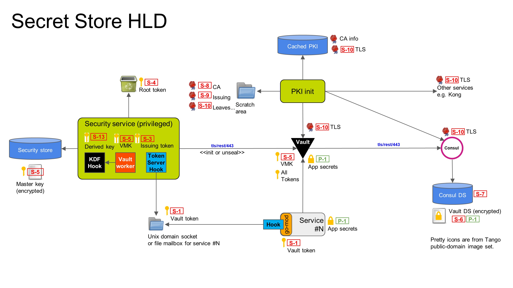
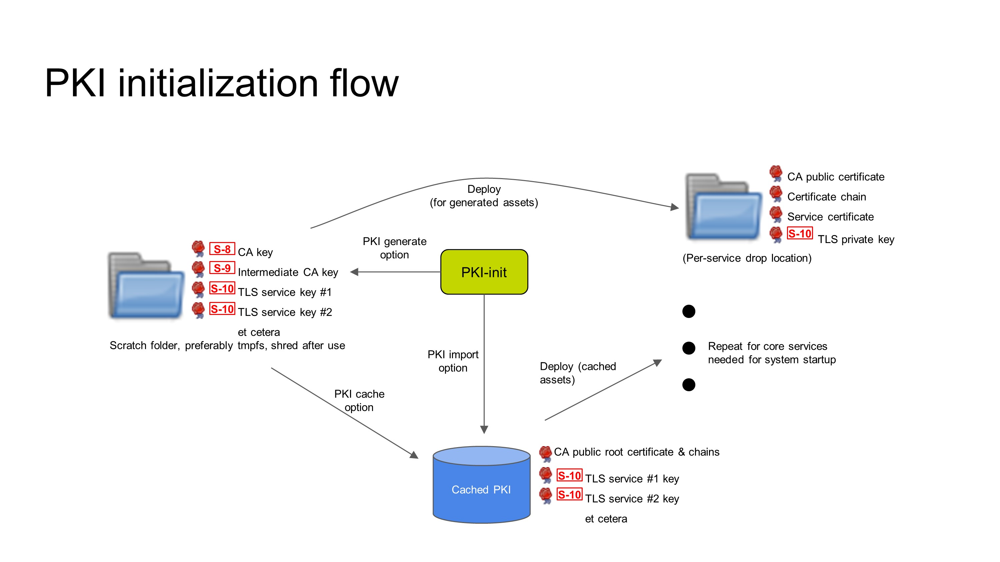
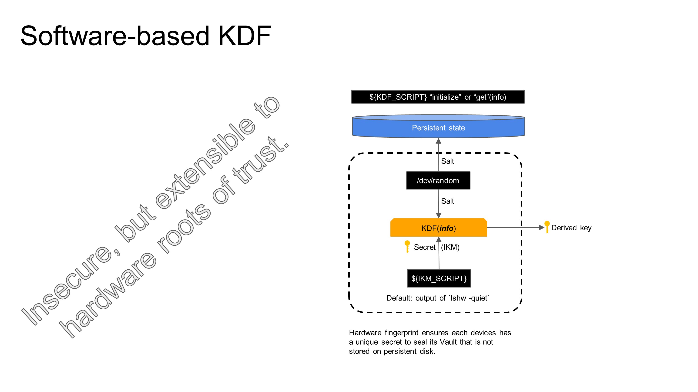
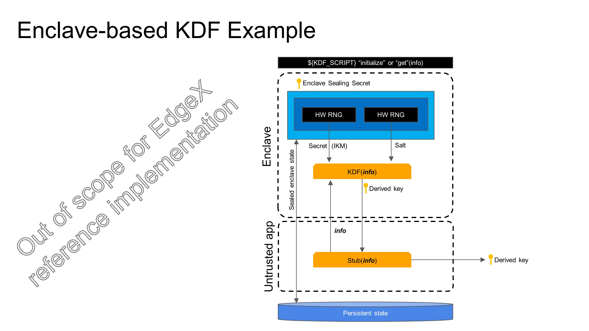
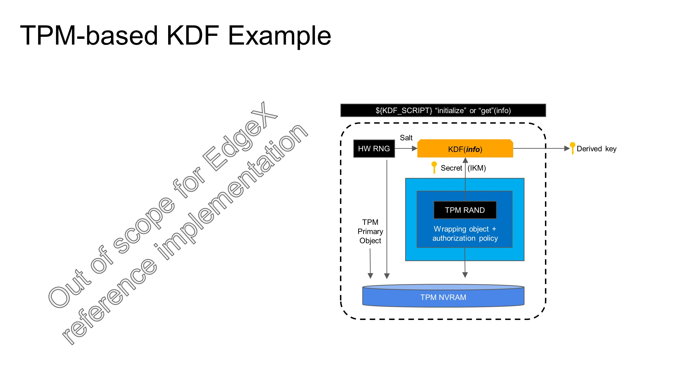
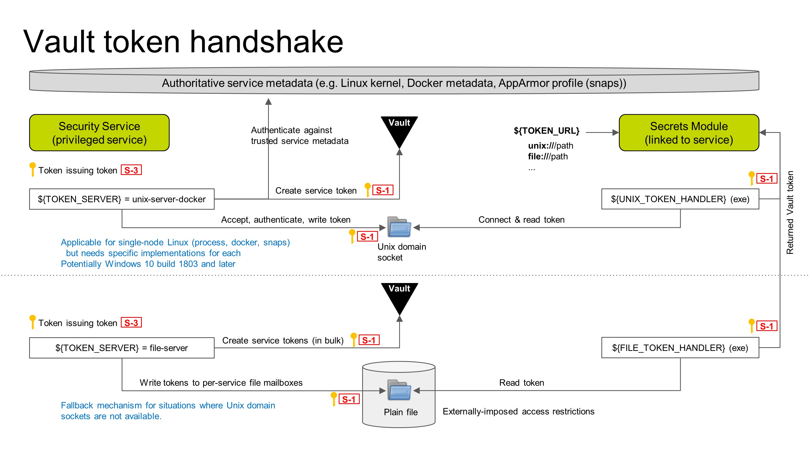

# Detailed Design

This document gets into the design details of the proposed secret management architecture, starting with a design overview and going into greater detail for each subsystem.

## Design Overview

In context of the stated future goal to support hardware-based secret storage, it is important to note that in a Vault-based design, not every secret is actually wrapped by a hardware-backed key.  Instead, the secrets in Vault are wrapped by a single master key, and the encryption and decryption of secrets are done in a user-level process _in software_--this is true even in the Enterprise Vault product.  The Vault master key is then wrapped by one more additional keys, ultimately to a root key that is hardware-based.  Typically this means that the Vault master key is treated as data that is encrypted with a wrapping key that is derived from another key that is programmed into hardware.  The data is unwrapped "in hardware" (which may be firmware with hardware-accelerated crypto) that implements some kind of authorization policy.  In a PKCS#11 hardware token, authorization is typically a PIN.  In a TPM, authorization is typically a set of PCR values and an optional password.  A software enclave could implement almost any kind of authorization including remote attestation.  The idea is that the Vault master key is _eventually_ protected by some device-specific unique secret that cannot be easily copied.  This design provides strong protections against at-rest attacks on the vault.  The software-based implementation in the EdgeX reference code implements the flow described above and provides hooks for hardware implementations, but the software-only implementation ultimately relies on a guessable root secret.

The hardware may or may not have non-volatile tamper-resistant storage.  Non-volatile storage is useful for integrity protection as well as in pre-OS scenarios.  An example of the former would be to store a hash value for HTTP Public Key Pinning (HPKP) in a manner that makes it difficult for an attacker to pin a different key.  An example of the latter would be storing a LUKS disk encryption key that can decrypt a root file system when normal file system storage is not yet available.  If non-volatile storage is available, it is often available only in very limited quantity.  It is also much harder to copy a HSM or TPM than it is to copy a magnetic hard disk, SSD, or eMMC/UFS media.

An obvious flaw with the above design is that at some point along the line, the Vault master key or a wrapping key is observably exposed to user-mode software.  In fact, the number two recommendation for [Vault hardening](https://www.vaultproject.io/guides/operations/production) is "single tenancy" which is further explained, in priority order, as (a) giving Vault its own physical machine, (b) giving Vault its own virtual machine, or (c) giving Vault its own container.  Option (d) -- run Vault as a standard Unix process -- is not even mentioned, and options (b) and (c) are discouraged!  The general solution to this problem is to use a Trusted Execution Environment (TEE) to prevent observability of the Vault master key and any wrapping keys.  There is currently no platform- and architecture-independent TEE solution, but [Microsoft OpenEnclave SDK](https://openenclave.io/sdk/) is an early attempt to create one.

## High-level design

Figure 1:  High-level design.

The secrets to be protected are the application secrets **(P-1)**. The application secrets are protected with a per-service [Vault](https://www.vaultproject.io/) [service token](https://www.vaultproject.io/docs/concepts/tokens.html#service-tokens) **(S-1)**.  The Vault service token is delivered by connecting to a Unix domain socket on which a token server is listening. The token server authenticates the caller by its peer process ID, authorizes the request by cross-referencing the process ID with a trusted information source (Linux kernel or Docker daemon), and then delivers a service-specific Vault token.  As a fallback method (configuration option), the Vault token is pre-populated and the service only need read the token out of a file, where Mandatory Access Control or namespaces constrain path accessibility. Vault access tokens are simply 128-bit random handles that are renewed at the Vault server.  They can be shared across multiple instances of a load-balanced service, and unlike a JWT there is no need to periodically re-issue them if they have not expired.

The token server has its own non-root token-issuing token **(S-3)** that is created by the security service with the root token after it has initialized or unlocked the vault but before the root token is revoked. **(S-4)**  For availability reasons and because it requires privilege to authenticate callers, it is co-located in the security service.

The actual application secrets are stored in the Vault encrypted data store **(S-6)** that is actually stored in Consul's data store **(S-7)**.  The vault data store is encrypted with a master key **(S-5)** that is held in Vault memory and forgotten across Vault restarts.  The master key must be resupplied whenever Vault is restarted.  The security service monitors Vault health and will automatically unseal the vault if it is determined to be in a sealed state.  The security service encrypts the master key with AES-256-GCM using a key **(S-13)** derived using a pluggable Key Derivation Function and stores it encrypted in persistent storage.  The software-only KDF derives a key based on a hardware fingerprint, such as the output of `lshw` .  In this manner the initial keying material for the KDF is never stored persistently on disk and is unique if the storage media exposes serial numbers, although it is cryptographically weak.  Vendor implementations may create KDFs that rely on hardware mechanisms such as trusted execution environments (TEEs), enclaves, or dedicated hardware such as a TPM, so long as it can be invoked as a standalone executable.  Such implementations are out of the scope of the EdgeX Foundry reference implementation, which is software-only.

Confidentiality of the secret management APIs is established using server-side TLS.  In fact, Vault _requires_ TLS to boot.  The PKI initialization component is responsible for generating a root certificate authority **(S-8)**, one or more intermediate certificate authorities **(S-9)**, and several leaf certificates **(S-10)** needed for initialization of the core services.  The PKI can be generated afresh every boot, or installed during initial provisioning and cached.  As in the file-based Vault service token distribution case, namespacing or Mandatory Access Control is assumed to guard the TLS private keys for services.  If the implementation allows, the private keys for certificate authorities should be destroyed after PKI generation to prevent unauthorized issuance of new leaf certificates, except where the certificate authority is stored in Vault and controlled with an appropriate policy.  TLS keying material is distributed to services via the same file-based mechanisms using the same kinds of protections mentioned earlier.  TLS private keys are not password-protected due to lack of support for this protection in the consuming services.

## PKI Initialization

Figure 2: PKI initialization.

PKI initialization must happen before any other component in the secret management architecture is started because Vault requires a PKI to be in place to protect its HTTP API.  Creation of a PKI is a multi-stage operation and care must be taken to ensure that critical secrets, such as the the CA private keys, are not written to a location where they can be recovered, such as bulk storage devices.  The PKI can be created on-device at every boot, at device provisioning time, or created off-device and imported.  Caching of the PKI is optional if the PKI is created afresh every boot, but required otherwise.  Following creation of the PKI, or retrieving it from cache, the PKI initialization is responsible for distributing keying material to pre-agreed per-service drop locations that service configuration files expect to find them.

PKI initialization is not instantaneous.  Even if PKI initialization is started first, dependent services may also be started before PKI initialization is complated.  It is necessary to implement init-blocking code in dependent services that delays service startup until PKI assets have been delivered to the service.

Most dependent services do not support encrypted TLS private keys.  File access controls offered by the underlying execution environment are their only protection.  A potential future enhancement is to use the pluggable Key Derivation Function to derivate an encryption key to encrypt the cached PKI keying material at rest.

## Vault initialization and unsealing flow

Figure 3: Vault initialization and unsealing flow

When the security service starts the first thing that it does is check for the existence of an encrypted Vault master key.  If it is not present, it attempts to initialize the Vault.  Otherwise, it checks Vault's status and if sealed automatically unseals it.

This component uses a number of plugins that are packaged as executables that return results on their standard output.  The EdgeX reference implementation provides software-based reference plugins that are portable across a wide variety of platform architectures.  Binding of the EdgeX Vault to a hardware root of trust is done through use of out-of-tree hardware-dependent plugins.

The security service has three different plugin hooks:

* `SALT_SCRIPT`: This environment variable specifies an executable that supplies a random salt value on its standard output.  By default, this script will use the golang hardware random number generator API.
* `KDF_SCRIPT`: This environment variable specifies an executable that takes a user-supplied "info" argument that is supplied to an HMAC KDF.  The KDF takes input key material (IKM) and a random seed and uses these to produce a pseudorandom key (PRK).  The "info" argument is then used to derive multiple keys from this.  The same input key material and same seed can be used to reproducibly derive a tree of keys from the initial secret.  The input key material must be kept secret, but the seed and info need not be.  In the case of a hardware KDF, the input key material should simply be a hardware-protected persistent large random number.
* `IKM_SCRIPT`: This is used in the reference software KDF to supply input key material in the case where hardware secure storage is not available.  By default, this script will attempt to compute and return a fingerprint of the running system.  The output of the IKM_SCRIPT is never stored persistently.

### Initialization flow

For the Vault initialization flow, Vault is initialized with a single key share.  The Vault master key is then encrypted with the KDF-derived key using AES-256-GCM using a plugin-supplied random salt value.  AES-GCM protects against padding oracle attacks, but is sensitive to re-use of the salt value.  For this application, it is expected that Vault master key is encrypted exactly once on a given platform and thus there is sufficient entropy in the salt to avoid encrypting a different master key with the same salt even if the Vault is initialized multiple times (for example, a QA platform).

The encrypted master key is then stored in persistent storage along with the salt value.

The facility provided by Vault to PGP-wrap key shares on initialization is not used, as it would require introducing the `openpgp` dependency.  Direct encryption of the Vault master key is simpler and isolates the implementation from implementation changes to `openpgp` that could result in decryption failures later.

### Unseal flow

In the unseal flow flow, the above process is reversed.  The KDF is invoked to regenerate the derived key used to encrypt the Vault mater key.  The salt is retrieved from persistent storage.  The wrapped master key is also retrieved from persistent storage and the master key decrypted.  The master key is then sent to Vault via its /sys/unlock API, and scrubbed from memory in the security service.

## Key derivation function examples

### Software-only KDF

Figure 4: Software-based KDF.

This simple software-based KDF uses initial keying material based a hardware fingerprint such as `lshw` and a random salt based on a hardware RNG such as `/dev/random`.  The IKM, salt, and info are passed into an HMAC KDF and the resulting derived key is output.  The salt value is saved or restored from an attached persistent store.  The salt is public and needs no special protection.

### Example enclave-based KDF

Figure 5: Example enclave-based KDF.

This encalve-based KDF example uses a hardware RNG to generate both the input key material and the salt value for the KDF.  Though only the IKM is secret, both are sealed to the enclave so that they are available for future invocations of the KDF.  The derived key is computed in the enclave and returned to the untusted app and output to the caller.

### Example TPM-based KDF

Figure 6: Example TPM-based KDF.

This TPM-based KDF example uses a TPM-based RNG to generate both the input key material and the salt value for the KDF.  The salt value is saved unencrypted to persistent storage, and the input key material is sealed to the TPM with an authorization policy.  The IKM as well as the TPM primary object are persisted in the TPM NVRAM.  The IKM, salt, and info are passed into an HMAC KDF and the resulting derived key is output.

The security of this approach is based on local attestation of the machine's state through use of the TPM platform configuration registers (PCRs).

## Token-issuing flow

Figure 7: Token-issuing flow.

### Client side

Every service that wants to query Vault must link to a secrets module and include one or more token handlers along with the service.  The secrets module will look for an environment variable, `${TOKEN_URL}` which encodes information on how to connect to Vault.  If the `${TOKEN_URL}` starts with a `unix://` path, the secrets module will invoke `${UNIX_TOKEN_HANDLER}` passing the supplied URL.  Similarly, a `file://` path will invoke `${FILE_TOKEN_HANDLER}`.  The distinction is important because Unix domain sockets must be connected using the `connect(2)` system call, whereas a file can just be `read(2)`.  The environment-variable hooks allows for extensibility such as `http://` token handlers, or `whizbang://` token handlers, and allow implementations to inject handlers into pre-built containers on-the-fly.  Although it does not have a means of authentication, the `file://` handler allows for the bootstrapping secret to be passed through a wide variety of other mechanisms, such standard file systems or Kubernetes secret volumes, as well as supporting development activities.

Windows 10 build 1803 and later have added support for Unix domain sockets.  However, it is unclear if the Windows implementation supports `SO_PEERCRED` and thus the ability to identify the other end of a socket.  The reference implementation will therefore support both Unix domain sockets and files.

### Server side

On the server side, the security service will launch the `${TOKEN_SERVER}` after Vault is unsealed.  There will be two reference implementations of the token server:

* **unix-server-docker**: Opens a Unix domain socket and waits for connections. Upon connection, the token server authenticates the caller by its peer process ID, authorizes the request by cross-referencing the process ID with a trusted information source (Linux kernel or Docker daemon), and then delivers a service-specific Vault token. 
* **file-server:** This token server is pre-configured with a list of services that it supports, and a set of output mailboxes.  At startup, the service tokens are created in bulk and delivered to the corresponding file-based per-service mailbox.  The file-server simply hangs at that point and waits for a termination signal.

Any given installation of the reference code should configure either the `unix-server-docker` or the `file-server`, and configure services with a matching `${TOKEN_URL}`.  

### Token revocation

Vault tokens are persistent.  Although they will automatically expire if they are not renewed, there should be a way to detect a full system reboot and revoke any previously-issued tokens before issuing new ones.  Failure to do so may allow an attacker to maintain an unauthorized Vault token indefinitely.

## Synergies with System Management

The [system management design](https://wiki.edgexfoundry.org/download/attachments/17498212/System%20Management%20Design-v8-Delhi-final.pdf?version=1&modificationDate=1534870659000&api=v2) proposes the existence of an agent that can start and stop EdgeX services via multiple [executors](https://wiki.edgexfoundry.org/display/FA/Systems+Management+Working+Group?preview=/329501/27492359/SMA-start-stop-restart-interface-v4.pdf). There are both opportunities and challenges for integrating with the system management agent.

Opportunties for SMA integration:
* System Management Agent is in an ideal position to inject some bootstrapping secrets into the services that it starts. This is the best case scenario for secret management as the service need not then prove its identity at a later phase.

Challenges for SMA integration:
* SMA is currently an optional service.  If only the SMA is allowed to inject a bootstrapping secret into a service then it becomes a required element of the secret management stack.
* In order to inject secrets on-the-fly, the docker-compose executor, or example, would have to modify docker-compose files on-the-fly. For snaps, it would somehow have to pass secrets into the snaps as they are started.
* In order for the SMA to obtain services' bootstrapping secrets, SMA would have to authenticate itself to another microservice that provides such secrets, or be started with a privileged token so that SMA could generate the bootstrapping secrets itself.  Both of these imply that SMA would have to be started later in the boot phase after the secret management subsystem was initialized.
* SMA is not in charge of starting services by default.  Instead, for Docker installations it is docker-compose.  For snaps, it is systemd unit files.  There would have to be a transition point between services that are started by the underlying orchestration and services that are started by SMA.  Such a transition point does not exist.
* Lastly, SMA is simply an API.  SMA delegates to the underlying executor to start and stop services.

For all of the above reasons, it is decided **not** to integrate systems management and secret management subsystems.